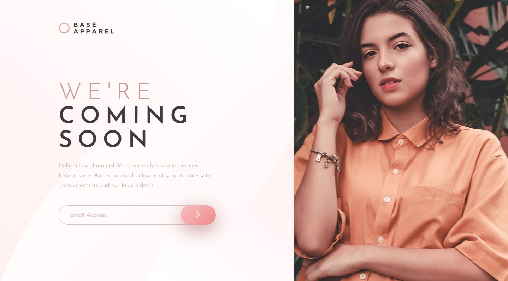
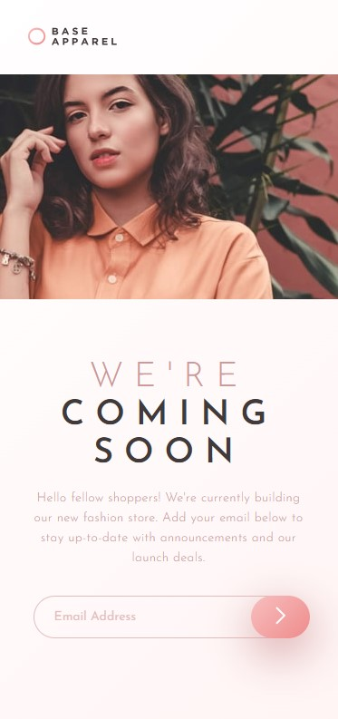
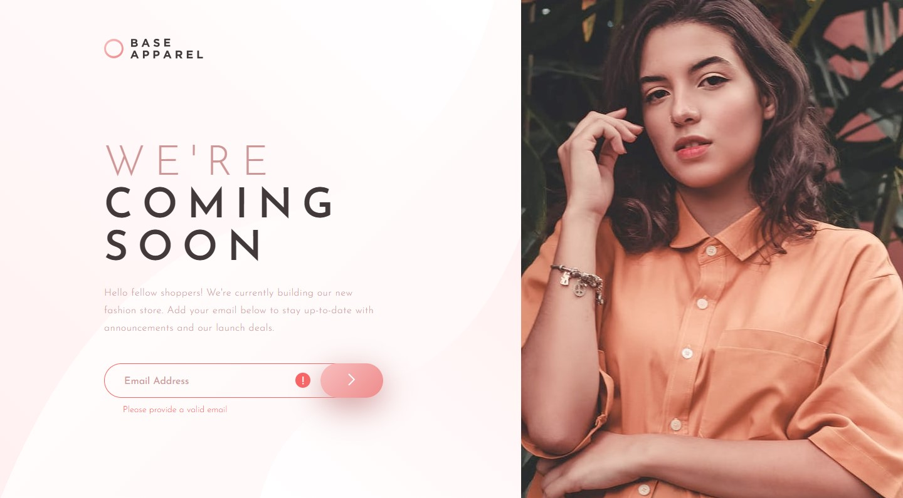

# Frontend Mentor - Base Apparel coming soon page solution

This is a solution to the [Base Apparel coming soon page challenge on Frontend Mentor](https://www.frontendmentor.io/challenges/base-apparel-coming-soon-page-5d46b47f8db8a7063f9331a0). Frontend Mentor challenges help you improve your coding skills by building realistic projects. 

## Table of contents

- [Overview](#overview)
  - [The challenge](#the-challenge)
  - [Screenshot](#screenshot)
  - [Links](#links)
- [My process](#my-process)
  - [Built with](#built-with)
  - [What I learned](#what-i-learned)
  - [Continued development](#continued-development)
- [Author](#author)

## Overview

### The challenge

Users should be able to:

- View the optimal layout for the site depending on their device's screen size
- See hover states for all interactive elements on the page
- Receive an error message when the `form` is submitted if:
  - The `input` field is empty
  - The email address is not formatted correctly

### Screenshot

Desktop Design

Mobile Design

Active State

### Links

- Solution URL: [GitHub URL](https://github.com/AgnerShimokawa/base-apparel-coming-soon-page)
- Live Site URL: [Live site URL](https://agnershimokawa.github.io/base-apparel-coming-soon-page/)

## My process

### Built with

- Semantic HTML5 markup
- CSS custom properties
- CSS Grid
- JavaScript

### What I learned

With this challenge I've learned how to properly align the elements in a way that it's responsive at any screen resolution, I had a lot of difficulties with the positioning of the picture in relation with the rest of the page, but after a few trials and errors I manage to align it. Then when it time to style the mobile version, another challenge, since I had made the entire left side one section, so I separated the logo from the rest and additional things started to get difficult. Eventually I was able to make everything work the way I wanted to, so great development with CSS.

With JavaScript it was fairly simple, with just a matter of knowing what to grab and how to check if the form was properly filled. 

### Continued development

It's clear that I need to take a look back at CSS to see the things that I've missed and things that I might not have quite understood, seems like the basics is there but with a few things missing, so I'll make sure to take a better look at this. 
In terms of JavaScript, I'm sure there are things that I need to improve, and probably there was a simpler way to do this challenge, so I'll keep on improving on that as well.

## Author

- GitHub - [AgnerShimokawa](https://github.com/AgnerShimokawa)
- Frontend Mentor - [@AgnerShimokawa](https://www.frontendmentor.io/profile/AgnerShimokawa)
- LinkedIn - [Agner Shimokawa](https://www.linkedin.com/in/agner-shimokawa/)